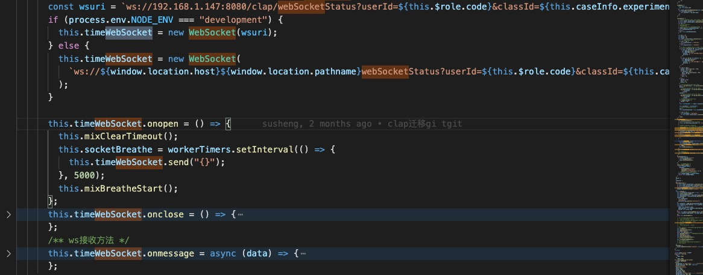
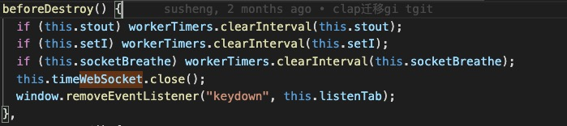
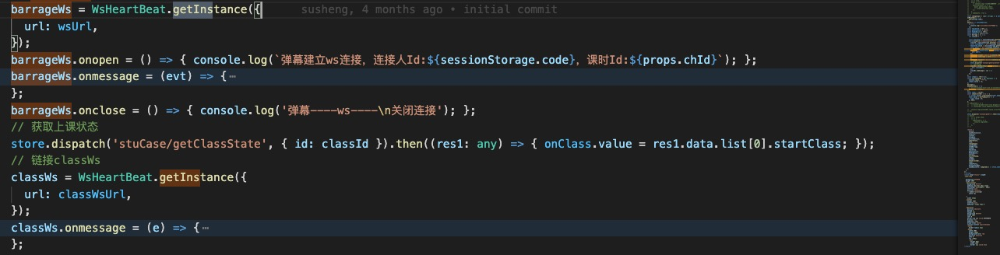

# ws-heartbeat-ts

### 组件名 `ws-heartbeat-ts`

### 使用场景
> 学生端实训过程中，需要和后端建立`ws`长链接，如`考试倒计时` `记录学习时长` `学生各组员消息发送`

### 解决了什么痛点
> 因为长链接会有断线情况，每次实例webSocket都需要额外处理心跳重连，繁琐且麻烦。故将心跳重连的逻辑实现一起封装到该库中，方便使用

### 实现方式
> 在创建ws时，使用定时执行函数，每隔一段时间就向后端发送消息，如果`发送失败`或`未接收到后端消息`，则表示该连接异常， 需要重新建立连接

> 为防止ws地址重复，将上一个ws顶掉的情况，采用了`单例模式`，即同一个地址的情况下，或得到的`ws`实例是同一个

### 用法
- 获得实例 `const ws = WsHeartBeat.getInstance({url})`
- 发送消息 `ws.sendData(object)` 该方法会自动将`object`转为json字符串
- 接收消息 `ws.onmessage = (data, event) => {}`
- - `data`为 `JSON.parse`解析过后的对象
- - `event`为原ws `message`对象
> 如果需要使用原`ws`发送字符串可以使用 `ws.send(str)`

### 使用前后对比

使用前
- 建立连接时需要手动设置心跳包，在接收到ws消息的时候，需要手动过滤心跳包
- 为了实现心跳重连效果，需要额外定义多个变量，用于存储timer
- 页面销毁后，除了要手动关闭ws外，还需要清除副作用（定时执行函数）

使用后
- 只需要处理ws的url地址，就可以自动处理心跳重连功能

### 其他部门配合
> 需要和后端讨论 收发消息 的数据格式

### [➡️详细文档](https://github.com/CurryPaste/ws-heartbeat-ts)